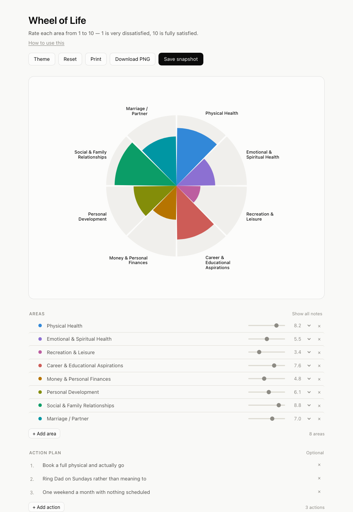

# Interactive Wheel of Life

An interactive version of the Wheel of Life coaching exercise. One HTML file, no
build step, no dependencies, no account, no server. Everything you type stays in
your own browser.

**[Open it in your browser →](https://augers-co.github.io/interactive-wheel-of-life/)**
&nbsp;·&nbsp;
[How to use it](https://augers-co.github.io/interactive-wheel-of-life/instructions.html)



## Why this exists

The paper version asks you to draw a line across each slice and eyeball the
shape. That works, but it's a pain to redo, and comparing today's wheel to the
one you drew three months ago means digging out the old sheet.

This does the same exercise with sliders, keeps your notes next to each area,
and can show you exactly what moved since last time.

## What it does

- **Eight areas, or three, or twenty.** Rename any area, add your own, delete
  the ones that don't apply. The wheel re-divides itself.
- **Drag to reorder.** List order is wheel order, so you can put related areas
  next to each other. Keyboard works too — focus a drag handle and use ↑/↓.
- **Recolour any area** by clicking its dot — a native colour picker, no
  library. A chosen colour is rendered exactly as picked. Generated defaults are
  spread around the colour wheel but skip the gold band, which goes muddy at the
  lightness they use.
- **Scored 1–10**, the scale the worksheet uses: 1 very dissatisfied, 10 fully
  satisfied. Each slice reaches out in proportion, so a 5 sits half way to the
  edge. The slider moves in tenths, so 7.4 is available if 7 and 8 both feel
  wrong. It will go to 0 if someone wants it to; nothing suggests it.
- **An optional note under every area,** collapsed by default. Click the chevron
  to record why a score is what it is.
- **An action plan.** Three optional rows beneath the areas for what you'll
  actually do. Add more, or delete them all.
- **Snapshots.** Save a dated copy of the whole wheel. Later, hit *Compare* and
  the wheel draws a line across each slice showing where it stood then, with a
  ▲/▼ change beside every slider.
- **Save as PDF** — writes a real PDF directly, no print dialog and no browser
  headers. Name, date, a full-size wheel, every score and note, and the action
  plan. Blank notes and actions are left out.
- **Export file / Import file** — the whole wheel, including snapshots, as a
  single file. Send it to a coach and they can import it and work with your
  wheel live, or reopen it yourself months later.
- **An optional name field**, used on the printed sheet and in export
  filenames.
- **Light by default**, with a dark toggle.

## Using it

Either open the [hosted version](https://augers-co.github.io/interactive-wheel-of-life/),
or download `index.html` and double-click it. Both behave identically.

To keep a copy you control:

```
git clone https://github.com/augers-co/interactive-wheel-of-life.git
```

or use **Code → Download ZIP** on GitHub, then open `index.html`.

## Sharing it

Two exports, doing different jobs:

| | What it's for |
|---|---|
| **Save as PDF** | Something to read or hand over. Generated in-page, so it looks identical everywhere. |
| **Export file** | Something to carry on with. A coach imports it and sees your live wheel; you reopen it next quarter and compare. |

Neither goes near a server — the PDF is produced by your browser's own print
engine and the file is written straight to your disk.

## Your data

There is no backend. Nothing is uploaded, there is no analytics, and the page
makes no network requests of any kind — you can pull the plug on your wifi and
it still works.

Scores, notes, actions and snapshots are saved in your browser's `localStorage`,
on the device you're using. That means:

- Your wheel does not follow you to another browser or another computer.
- Clearing site data, or "clear history" with site data included, erases it.
- Someone else using your browser profile can see it — **Delete all & reset**
  in the History section erases the lot.

Use **Export file** to write everything to a single JSON file, and **Import
file** to load it back. If you plan to compare wheels months apart, export one —
it is the only copy that survives a browser cleanup.

## The starting categories

The eight defaults are the life areas the exercise is conventionally built
around:

Physical Health · Emotional & Spiritual Health · Recreation & Leisure · Career &
Educational Aspirations · Money & Personal Finances · Personal Development ·
Social & Family Relationships · Marriage / Partner

They are a draft, not a prescription. Rename them, split one in two, drop the
ones that don't apply — the exercise only works if the slices describe your
actual life. [How to use this](instructions.html) walks through it.

Scores run 1–10, as on the paper worksheet, with one decimal place so you can
register small movements between sittings.

## For coaches

The page is one file. Fork the repo, change the `DEFAULTS` array near the top of
the `<script>` block, and you have a version with your own categories to hand to
clients:

```js
var DEFAULTS = [
  "Physical Health",
  "Emotional & Spiritual Health",
  // …
];
```

Nothing else needs to change. Clients' data never leaves their machine, so
there's nothing for you to host, secure, or delete on request.

## Browser support

Verified working from a local `file://` copy — saving, restoring and PNG export
all functional — in **Chrome**, **Firefox** and **Safari** on macOS. It should
work in any current browser. Drag-to-reorder uses HTML5 drag and drop, which
doesn't fire on touchscreens; on a tablet or phone, use the keyboard arrows on
the drag handle instead.

## A note on destructive actions

Reset, Restore, Delete and Import don't use `confirm()`. A browser that has been
told to stop showing dialogs for a page makes `confirm()` return `false`
forever, which turns every guarded action into a silent no-op. Those buttons arm
on the first click instead — they relabel themselves as a question, and act on a
second click within four seconds. Clicking elsewhere or pressing Escape cancels.

## Contributing

Issues and pull requests are welcome. It's deliberately a single file with no
build step — please keep it that way.

## Licence

MIT — see [LICENSE](LICENSE). Use it, change it, hand it to your clients, build
something commercial on it. Just keep the copyright notice.

The Wheel of Life exercise itself is a long-standing coaching tool in general
use and is not claimed as original work here. The licence covers this
implementation and the guidance text in `instructions.html`, both of which were
written from scratch for this project.
